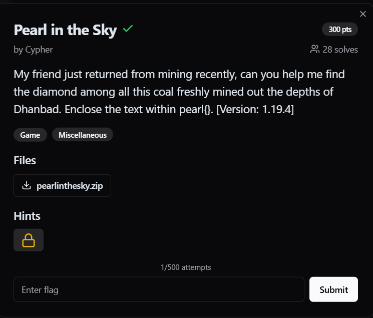
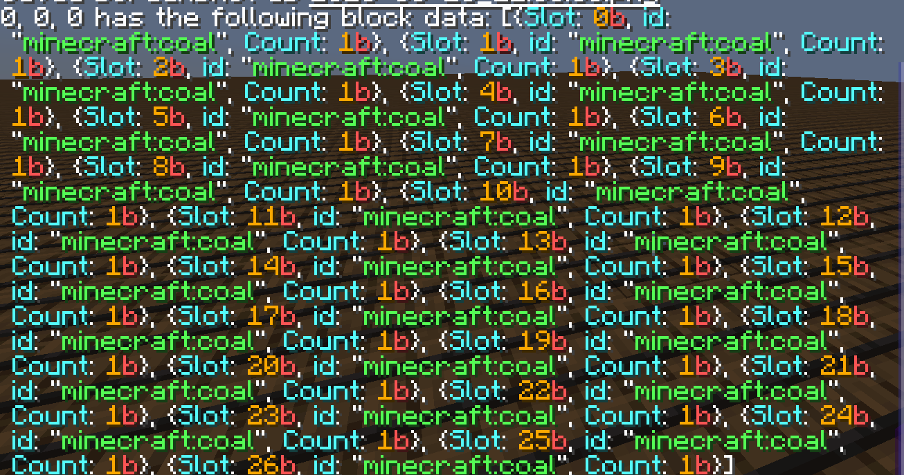
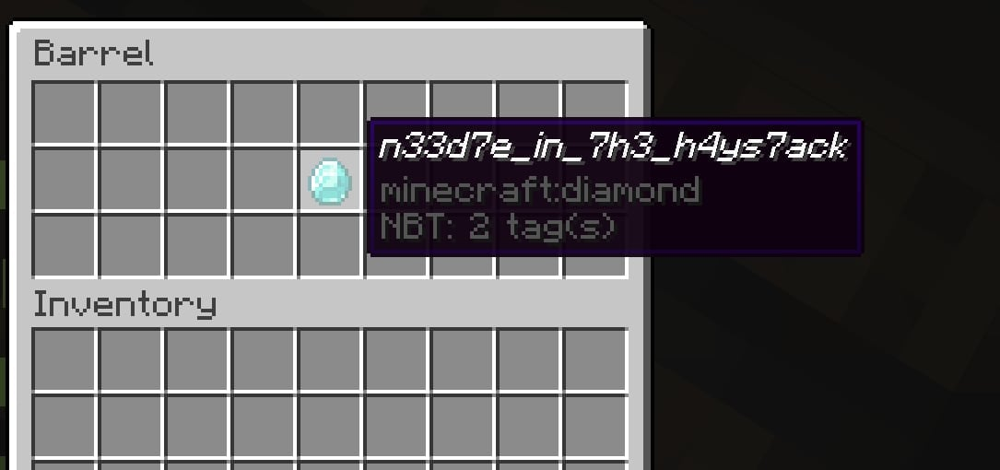
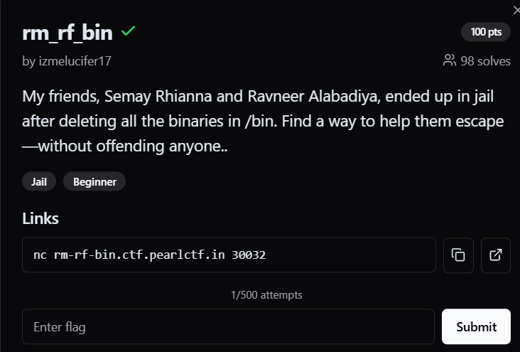
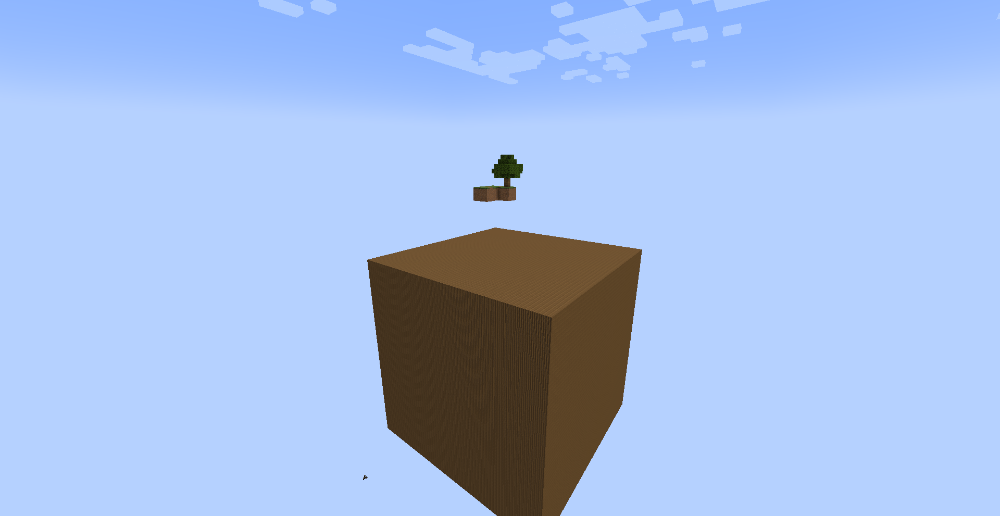
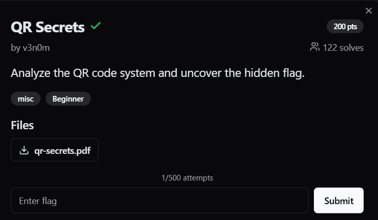
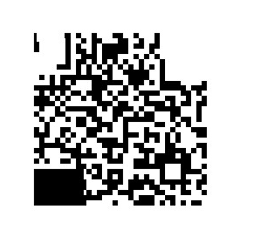

# Pearl in the Sky



I downloaded the file and found that it was a Minecraft map. Upon entering the map, I discovered that barrels filled the area from XYZ coordinates (0,0,0) to (60,60,60).


Each barrel either contained coal or was empty.
```
/execute as @a at @s run data get block 0 0 0 Items
```


Manually checking each barrel is practically impossible or would take an extremely long time. :))))

So, I decided to use a `Minecraft function`.
```
saves\Challengeitis\datapacks\<name>\data\<name>\functions\test.mcfunction
```

Here, I created a folder inside the world’s `saves` directory. Inside that folder, I created a `data` folder and a file named `pack.mcmeta` with the following content:
```
{
  "pack": {
    "pack_format": 12,
    "description": "Scan"
  }
}
```

Next, I used a script to generate `execute` commands for all coordinates within the XYZ range (0,0,0) to (60,60,60).

```py
num_files = 10
commands_per_file = (60 * 60 * 60) // num_files 
command_count = 0
file_index = 1

for x in range(60):
    for y in range(60):
        for z in range(60):
      
            if command_count % commands_per_file == 0:
                if command_count != 0:
                    f.close()  
                f = open(f"Commands_{file_index}.mcfunction", "w")
                file_index += 1

            f.write(f'execute as @a at @s run execute if block {x} {y} {z} minecraft:barrel run execute if data block {x} {y} {z} {{Items:[{{id:"minecraft:diamond"}}]}} run tellraw @a {{"text":"Block at ({x}, {y}, {z}) contains diamond!","color":"green"}}\n')

            command_count += 1

f.close()

print(f"{num_files} created.")
```

Since the number of commands that can be executed is limited by the `short int` constraint, I split them into multiple files.


The coordinates of the target are `(36, 43, 23)`, so I went to that location to check.



Flag:
```
pearl{n33d7e_in_7h3_h4ys7ack}
```

---

# rm_rf_bin



In this challenge, it seems that executable files in `/bin` were deleted, making commands like `ls`, `cat`, etc., unavailable.

So, I turned to shell "built-in" commands. These are commands integrated into the shell that do not require separate executable files.
```
read var < flag.txt; echo $var
```



Flag:
```
pearl{shell_builtins_to_the_rescue!!}
```

---

# QR Secrets



For this challenge, the QR code was in an incorrect format, so I simply fixed it.




Flag:
```
pearl{unl0ck_s3cr3ts_scan_2_find}
```
